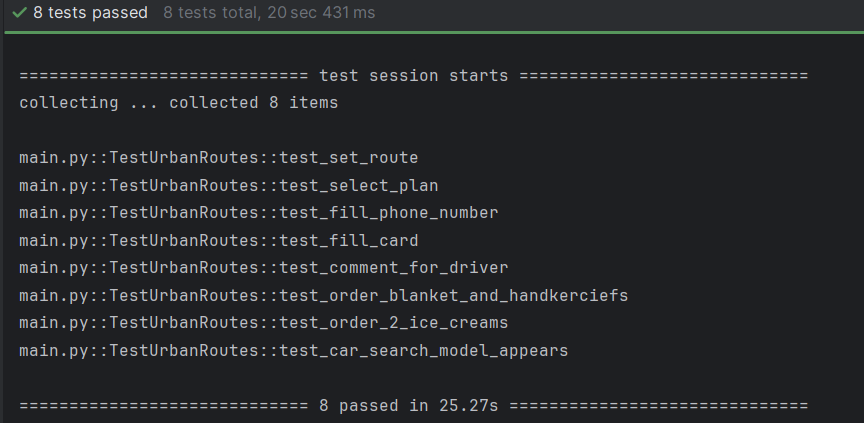

# 📌 Sprints 07 & 08 – Automação de Testes - Roberth Guimaro

# Automação de Testes – Urban Routes

## Objetivo

O projeto tem como foco automatizar tarefas de teste web na aplicação **Urban Routes**, garantindo que os fluxos críticos funcionem de ponta a ponta sem falhas manuais. A ideia é validar cenários reais de uso, como rotas, planos de viagem e pagamentos, de forma rápida, repetível e confiável.

## Escopo

* Automação de fluxos principais do usuário:

  * Definir origem e destino.
  * Selecionar plano de viagem.
  * Preencher formulários, incluindo dados de pagamento.
  * Validar mensagens de erro e campos obrigatórios.
* Estrutura organizada no padrão **Page Object Model (POM)** para facilitar manutenção.
* Execução automatizada via **Pytest**.

## Stack

* **Python**
* **Selenium WebDriver**
* **Pytest**
* Estrutura de Page Objects
* Git/GitHub para versionamento

## Como rodar

1. Clone o repositório:

   ```bash
   git clone https://github.com/RoberthGuimaro/TripleTen_Analyst_QA_Sprint_7_&_8_Automacao_de_Testes.git
   cd TripleTen_Analyst_QA_Sprint_7_&_8_Automacao_de_Testes
   ```

2. Crie o ambiente virtual e ative:

   ```bash
   python -m venv venv
   source venv/bin/activate   # Linux/Mac
   venv\Scripts\activate      # Windows
   ```

3. Instale as dependências:

   ```bash
   pip install -r requirements.txt
   ```

4. Rode os testes:

   ```bash
   pytest
   ```

## Como testar

* Os testes estão organizados em **Page Objects**.
* Para criar novos testes, basta adicionar os elementos na página correspondente e escrever o fluxo no arquivo de testes.
* A execução pode ser feita diretamente pelo **pytest**.

## Evidências

- Resultado da suíte de testes  
  

- Fluxo automatizado rodando no navegador  
  <video src="evidencias/execucao_completa.mp4" controls>

## Métricas
- **Casos automatizados**: 8  
- **Tempo médio de execução da suíte**: ~28 segundos  
- **Cobertura dos fluxos críticos**: 100%  
